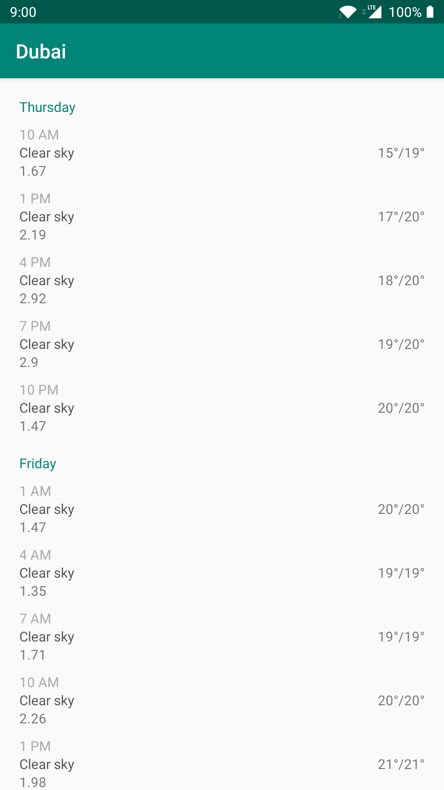
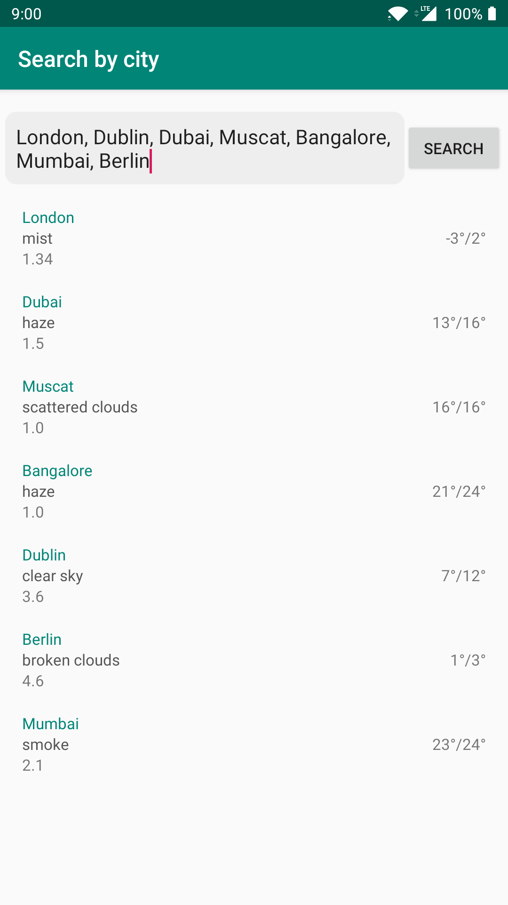

## Mausam
A weather application utilizing OpenWeatherMap Api 

### Libraries & Tools
- MVVM Architecture
- Android Jetpack
- Dagger2
- Retrofit/OkHttp
- Kotlin Coroutines 

### Screenshots



### How To Run
Build

```./gradlew assembleDebug```

Install 

``` adb install -r -t app/build/outputs/apk/debug/app-debug.apk ```

### Build test coverage report
``` ./gradlew testDebugUnitTestCoverage ```